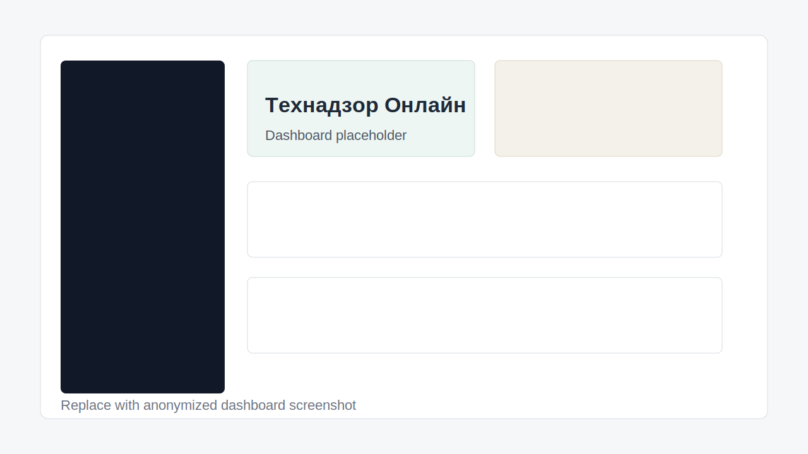
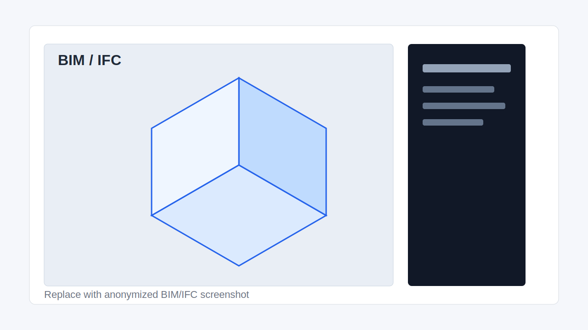
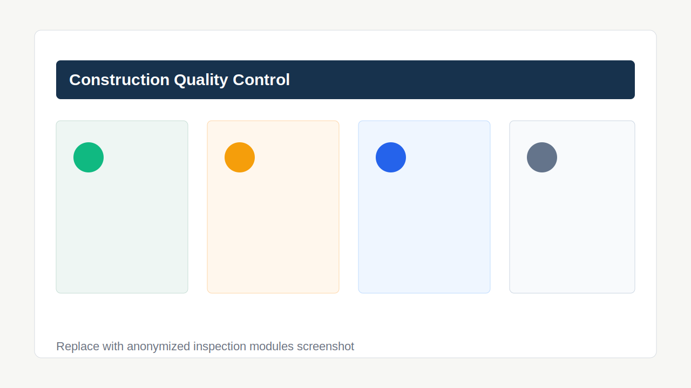

# Технадзор Онлайн

Веб-приложение для строительного технического надзора, цифрового контроля качества и работы с BIM/IFC-данными на объекте строительства.

Проект объединяет журнал проверок, модули контроля геодезии, армирования, геометрии и прочности, импорт IFC-моделей, хранение данных в Firebase и локальный Node/Express API для отчетов и серверных операций.

## Why This Project Matters

Строительный технадзор часто остается разрозненным: замечания живут в таблицах, фото - в мессенджерах, BIM-модель - отдельно, а итоговые акты собираются вручную. Это повышает риск потери контекста, спорных решений и повторных дефектов.

`Технадзор Онлайн` нужен как открытая основа для цифрового контроля качества:

- связывает проверки с проектом, конструкциями, допусками и ответственными участниками;
- помогает переводить фактические отклонения в структурированные данные, пригодные для отчетности;
- добавляет BIM/IFC-контекст к контролю, чтобы замечания можно было сопоставлять с элементами модели;
- снижает ручную работу инженера при подготовке итоговых заключений;
- создает базу для прозрачного аудита качества на стороне заказчика, подрядчика и технического заказчика.

## Возможности

- Авторизация через Firebase Authentication.
- Управление проектами и профилем инженера.
- Журнал проверок и замечаний.
- Модули контроля: геодезия, армирование, геометрия, прочность бетона.
- BIM/IFC-инструменты: чтение IFC, импорт элементов, визуальная панель, viewer harness для разработки.
- Генерация итогового текста отчета по результатам проверок.
- Профильная лента и публичные страницы.
- Service Worker и статическая сборка клиента.
- Локальный Express API и Firebase Functions для серверных сценариев.

## Screenshots

Пока вместо реальных скриншотов используются заглушки. Перед публичной заявкой замените их актуальными изображениями интерфейса без персональных данных, адресов объектов, ФИО, телефонов, email и закрытых проектных материалов.







## Технологический стек

- Frontend: HTML, CSS, TypeScript.
- 3D/BIM: Three.js, That Open Components, web-ifc, ifc-lite.
- Backend: Node.js, Express, TypeScript.
- Cloud: Firebase Hosting, Firestore, Authentication, Firebase Functions.
- Tooling: npm, TypeScript, ESLint, Node test runner, esbuild.

## Структура проекта

```text
.
├── src/
│   ├── client/                  # Канонический клиентский TypeScript-код
│   └── shared/                  # Общая логика и типы
├── server/
│   └── src/                     # Локальный Node/Express API
├── functions/
│   └── src/                     # Firebase Functions
├── scripts/                     # Build и maintenance scripts
├── tests/smoke/                 # Smoke-регрессии публичных страниц
├── tools/viewer-harness/        # Dev-only BIM viewer harness
├── docs/                        # Техническая документация
├── docs/screenshots/            # Заглушки и будущие скриншоты
├── *.html / *.css / assets      # Статическая поверхность приложения
├── dist/                        # Generated output клиента
├── server/dist/                 # Generated output локального API
└── functions/dist/              # Generated output Firebase Functions
```

## Source Of Truth

Редактируйте исходники, а не generated output:

- клиент: `src/client/**`;
- shared-слой: `src/shared/**`;
- локальный сервер: `server/src/**`;
- Firebase Functions: `functions/src/**`;
- `index.html`: собирается из `src/client/index-partials/**`;
- `sw.js`: собирается из `src/client/sw.ts`.

Не редактируйте вручную:

- `dist/**`;
- `server/dist/**`;
- `functions/dist/**`;
- корневой `sw.js`.

## Локальный запуск

Требования:

- Node.js 20+;
- npm;
- Python 3 для простого статического сервера или любой другой static file server;
- Firebase CLI для эмуляторов и деплоя Firebase Functions.

Установка зависимостей:

```bash
npm install
cd server && npm install
cd ../functions && npm install
cd ..
```

Настройка Firebase web config для клиента:

```bash
cp .env.example .env
```

Заполните в корневом `.env` значения из Firebase Console -> Project settings -> General -> Your apps -> Web app:

```dotenv
FIREBASE_WEB_API_KEY=
FIREBASE_WEB_AUTH_DOMAIN=
FIREBASE_WEB_PROJECT_ID=
FIREBASE_WEB_STORAGE_BUCKET=
FIREBASE_WEB_MESSAGING_SENDER_ID=
FIREBASE_WEB_APP_ID=
```

Без этих значений `npm run build:client` завершится ошибкой, чтобы в `dist/firebase.js` не попадали placeholder-строки вроде `__FIREBASE_WEB_API_KEY__`.

Сборка клиента и запуск статического приложения:

```bash
npm run build:client
python -m http.server 8000
```

Откройте `http://localhost:8000`.

Локальный API:

```bash
npm run build:server:ts
cd server
cp .env.example .env
npm run dev
```

API будет доступен на `http://localhost:5050`. Для разработки без Firebase Admin credentials можно временно выставить `AUTH_REQUIRED=false` в локальном `.env`; не используйте это в публичном окружении.

Firebase Functions:

```bash
npm run build:functions:ts
cd functions
npm run serve
```

## Package Scripts

Команды выполняются из корня проекта, если не указано другое:

| Command | Назначение |
| --- | --- |
| `npm run clean` | Удаляет runtime/build артефакты перед новой сборкой. |
| `npm run build:index-html` | Собирает корневой `index.html`. |
| `npm run build:client` | Собирает клиент и BIM viewer. |
| `npm run build:server:ts` | Компилирует локальный Express API. |
| `npm run build:functions:ts` | Компилирует Firebase Functions. |
| `npm run build:profile-feed` | Генерирует статическую профильную ленту. |
| `npm run build` | Полная сборка проекта. |
| `npm run lint` | Запускает ESLint. |
| `npm run typecheck` | Проверяет TypeScript-проекты. |
| `npm test` | Запускает smoke-тесты. |

Серверные подпроекты:

- `server`: `npm run dev`, `npm run start`, `npm run backfill:inspections`;
- `functions`: `npm run serve`, `npm run deploy`.

## Firebase И Секреты

Никогда не публикуйте реальные service account файлы, приватные ключи и `.env`.

### Firebase web config

Клиентский Firebase config не хранится в `src/client/firebase.ts`. При сборке `npm run build:client` скрипт `scripts/inject-firebase-config.mjs` читает корневой `.env` или переменные окружения `FIREBASE_WEB_*` и подставляет значения в generated-файл `dist/firebase.js`. Если `.env` отсутствует или `FIREBASE_WEB_API_KEY` не задан, сборка падает с ошибкой.

`.firebaserc` содержит безопасный placeholder `your-firebase-project-id`. Для деплоя замените его на id своего Firebase-проекта или выполните:

```bash
firebase use --add
```

Firebase web API key не является Firebase Admin secret, но он идентифицирует проект. Защищайте проект правилами Firestore/Auth, ограничениями доменов и App Check там, где это возможно.

### Firebase Admin credentials

Firebase Admin credentials поддерживаются в таком порядке:

1. `FIREBASE_PROJECT_ID` + `FIREBASE_CLIENT_EMAIL` + `FIREBASE_PRIVATE_KEY`;
2. `FIREBASE_SERVICE_ACCOUNT_PATH`;
3. локальный untracked-файл `server/serviceAccount.local.json`;
4. Google Application Default Credentials.

Пример локального service account лежит в `server/serviceAccount.local.example.json`. Это шаблон, а не настоящий ключ.

## Security

См. [SECURITY.md](SECURITY.md).

Коротко:

- не открывайте публичные issues с реальными токенами, ключами, персональными данными и объектной документацией;
- проверяйте Firestore Rules перед публикацией;
- не запускайте production API с `AUTH_REQUIRED=false`;
- удаляйте реальные данные из скриншотов, IFC-файлов и демо-дампов.

## Contributing

См. [CONTRIBUTING.md](CONTRIBUTING.md).

Основные правила:

- не менять бизнес-логику в документационных PR;
- не редактировать generated output вручную;
- запускать `npm run lint`, `npm run typecheck` и `npm test` для изменений кода;
- не добавлять секреты и приватные данные.

## Roadmap

- Заменить скриншоты-заглушки реальными anonymized screenshots.
- Добавить демо-режим без реального Firebase-проекта.
- Расширить BIM/IFC import mapping и поддержку типовых элементов.
- Связать замечания технадзора с IFC GlobalId и координатами модели.
- Добавить экспорт отчетов в PDF/DOCX с шаблонами заказчика.
- Добавить CI для lint, typecheck, smoke tests и secret scanning.
- Описать архитектуру Firestore collections и security rules.
- Подготовить sample dataset без персональных и коммерческих данных.
- Добавить issue templates и pull request template.

## Лицензия

Проект распространяется по лицензии MIT. Это permissive open-source лицензия: она позволяет использовать, изучать, модифицировать и распространять код в исследовательских, образовательных, государственных и коммерческих сценариях при сохранении copyright notice и текста лицензии.

MIT выбрана потому, что для строительного технадзора и BIM-инструментов важна широкая внедряемость: подрядчики, заказчики, интеграторы и образовательные команды могут адаптировать основу под свои процессы без сложных лицензионных ограничений. При этом лицензия явно снимает гарантийные обязательства с авторов.
